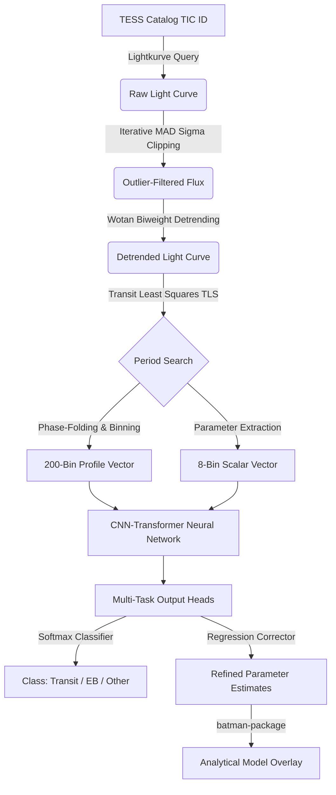

# 🪐 TRANSIT — AI-Powered Exoplanet Detector

<p align="center">
  
  
  
  
  
</p>

---

## 🌌 Project Overview

**TRANSIT** is an end-to-end, physically-informed deep learning data analysis pipeline designed to detect and validate exoplanetary transits from noisy stellar light curves. Developed for **BAH 2026 · Problem Statement 7 · Team Bharat Ka Khazana**, the pipeline addresses the critical challenges of astronomical target search in crowded stellar fields, where signals are heavily corrupted by:
* **Stellar Blending:** Light contamination from nearby stars.
* **Systematic Noise:** Cosmic ray hits, camera jitter, and detector anomalies.
* **Astrophysical Mimics:** Eclipsing Binaries (EBs) and rotating starspots.

By combining robust physics-based matched filtering (**Transit Least Squares**) with a hybrid **CNN-Transformer** neural network, **TRANSIT** cleans raw data, isolates periodic dips, estimates physical parameters, and runs deep inference with high confidence.

---

## 🚀 Pipeline Architecture & Workflow

The pipeline utilizes a sequential hybrid workflow merging astrophysical modeling with deep learning:



### 🛰️ Core Components:
1. **Target Acquisition:** Downloads high-cadence (2-minute SPOC) observations from the MAST archive using TESS Input Catalog (TIC) IDs.
2. **Data Detrending & Cleaning:** 
   * Runs an iterative **Median Absolute Deviation (MAD)** sigma-clipping filter ($4.0\sigma$ lower, $5.0\sigma$ upper bounds) to eliminate instrument cosmic ray spikes.
   * Fits a robust **biweight filter** via `wotan` (0.5-day window) to flatten out long-term stellar variability while maintaining transit signal shapes.
3. **Template Search (TLS):** Matches the cleaned curve against physical limb-darkened transit shapes. Extracts critical metrics such as **Signal Detection Efficiency (SDE)** and **Signal-to-Noise Ratio (SNR)**.
4. **CNN-Transformer Model:**
   * **CNN Branch:** Extracts spatial features (depth, symmetry, and ingress/egress shape) from a 200-bin phase-folded transit profile.
   * **Transformer Attention Block:** Maps sequence dependencies, evaluating which parts of the profile are contributing most to the classification.
   * **MLP Feature Fusion:** Fuses structural parameters (SDE, SNR, depth, duration, period) with attention feature vectors.
5. **Analytical Overlay:** Performs an analytical orbit fit utilizing the `batman` package to overlay the raw candidate data, providing a baseline comparison for validation.

---

## 👥 Meet Team Bharat Ka Khazana

<table align="center" style="border: none; border-collapse: collapse;">
  <tr>
    <td align="center" width="33%" style="border: none; padding: 15px; vertical-align: top;">
      <br>
      <strong>Kritika Benjwal</strong><br>
      <small>Lead AI Engineer & Pipeline Architect</small><br>
      <p style="font-size: 0.85em; color: #666; line-height:1.4; text-align: left; margin-top: 10px;">
        Engineered the core PyTorch model integrating convolutional filters and multi-head attention. Built regression heads and compiled automated deployment pipelines using Docker.
      </p>
      <hr style="border: 0; border-top: 1px solid #eee; margin: 8px 0;">
      <a href="https://github.com/Kritika11052005" target="_blank"></a>
      <a href="https://www.linkedin.com/in/kritika-benjwal" target="_blank"></a><br>
      <a href="mailto:ananya.benjwal@gmail.com" style="font-size: 0.8em; color: #00d2ff;">ananya.benjwal@gmail.com</a>
    </td>
    <td align="center" width="33%" style="border: none; padding: 15px; vertical-align: top;">
      <br>
      <strong>Sarthak Gupta</strong><br>
      <small>Astrophysics & Signal Processing Lead</small><br>
      <p style="font-size: 0.85em; color: #666; line-height:1.4; text-align: left; margin-top: 10px;">
        Led physical signal pre-processing, detrending configurations (Wotan biweight optimization), and Transit Least Squares template alignment. Developed error budgets and performed EDA.
      </p>
      <hr style="border: 0; border-top: 1px solid #eee; margin: 8px 0;">
      <a href="https://github.com/SarthakG1801" target="_blank"></a>
      <a href="https://www.linkedin.com/in/sarthakgupta1801" target="_blank"></a><br>
      <a href="mailto:sarthakgupta1971@gmail.com" style="font-size: 0.8em; color: #00d2ff;">sarthakgupta1971@gmail.com</a>
    </td>
    <td align="center" width="33%" style="border: none; padding: 15px; vertical-align: top;">
      <br>
      <strong>Chaitanya Yadav</strong><br>
      <small>Data Engineer & Deployment Specialist</small><br>
      <p style="font-size: 0.85em; color: #666; line-height:1.4; text-align: left; margin-top: 10px;">
        Collaborated on data pipeline optimization, detrending workflows, and model inference integrations. Managed repository synchronization and Hugging Face container configurations.
      </p>
      <hr style="border: 0; border-top: 1px solid #eee; margin: 8px 0;">
      <a href="https://github.com/chaitanyayad" target="_blank"></a>
      <a href="https://www.linkedin.com/in/chaitanya-yadav-ba44503a9/" target="_blank"></a><br>
      <a href="mailto:chaitanya.yad007@gmail.com" style="font-size: 0.8em; color: #00d2ff;">chaitanya.yad007@gmail.com</a>
    </td>
  </tr>
</table>

---

## 🛠️ Installation & Local Usage

Running **TRANSIT** locally requires a Python environment and standard compiler tools (for building physical C-extensions in libraries).

### Prerequisites:
Make sure you have a C compiler installed:
* **Windows:** MSVC (Visual Studio Build Tools with C++ workload).
* **macOS:** Xcode Command Line Tools (`xcode-select --install`).
* **Linux:** GCC/Build-Essential (`sudo apt-get install build-essential`).

### Installation Steps:
1. Clone the repository:
   ```bash
   git clone https://github.com/Kritika11052005/TRANSIT-AI-Powered-Exoplanet-Detector.git
   cd TRANSIT-AI-Powered-Exoplanet-Detector
   ```
2. Create and activate a virtual environment:
   ```bash
   python -m venv .venv
   # Windows
   .venv\Scripts\activate
   # macOS/Linux
   source .venv/bin/activate
   ```
3. Install dependencies:
   ```bash
   pip install --upgrade pip
   pip install -r requirements.txt
   ```
4. Run the Streamlit application:
   ```bash
   streamlit run app.py
   ```

---

## 🔗 Project Resources & Links

* 📘 **Kaggle Notebook 1 (Data/EDA):** [Transit EDA & Detection](https://www.kaggle.com/code/kritikabenjwal/transit-eda-detection)
* 🧠 **Kaggle Notebook 2 (Model Training):** [Transit Model Training](https://www.kaggle.com/code/kritikabenjwal/transit-model-training)
* 🐙 **GitHub Repository:** [Kritika11052005/TRANSIT-AI-Powered-Exoplanet-Detector](https://github.com/Kritika11052005/TRANSIT-AI-Powered-Exoplanet-Detector)
* 🤗 **Hugging Face Spaces App:** [transit-exoplanet-detector](https://huggingface.co/spaces/Kritzzz11/transit-exoplanet-detector)

---

## 🐋 Docker & Hugging Face Spaces Deployment

The space is configured to automatically build and run using Docker.

### Local Docker Build:
If you want to run the containerized app locally:
```bash
docker build -t exoplanet-detector .
docker run -p 7860:7860 exoplanet-detector
```
Open `http://localhost:7860` in your web browser.

### Deploying to Hugging Face Spaces:
1. Log in to [Hugging Face](https://huggingface.co/) and click **New Space**.
2. Set Space Name (e.g., `transit-exoplanet-detector`) and choose **Streamlit** as SDK.
3. Add the Hugging Face space repository as git remote:
   ```bash
   git remote add origin https://huggingface.co/spaces/YOUR_USERNAME/YOUR_SPACE_NAME
   git branch -M main
   git push -u origin main --force
   ```
4. Use your Hugging Face Access Token with **Write** permission as your password during pushing.
